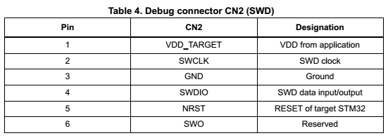

# 6通道无线振弦采集仪调试手册 #

### attention:本手册仅为参考，无法涵盖所有情况，不应理解为对调试方法的限制，应具体问题具体分析。 ###

## 电路原理图的使用方法 ##
+ 只要电路板上有的元器件，原理图上都有
+ 如果人眼找不到，使用ctrl + F搜索
+ 注意！画板子的师兄有的时候会在原理图上写几个字做标注，认真看师兄写的
+ 下文所说的引脚编号就是对应原理图上的引脚旁边的黑色数字
+ 在电路板上，有标识的那一边（比如三角，圆点，一条线等）一般都对应1号引脚。芯片有字母的那面对着自己，字是正的的时候，一般左下角开始为1号。芯片的1号一定要对着电路板上的1号。
+ 二极管，稳压管，钽电容，铝电解电容，发光二极管也都有正负，用到的时候自己查一下
+ 之后的调试请一直查看电路原理图

## 硬件调试步骤 ##
+ 确定供电正常：  
上电后，测试AMS1117的3号引脚对地电压，应为5V，若不是，检查电源输入、LM2700及其外围电路、以及所有接入了5V的器件。然后测试AMS1117的2号引脚对地电压，应为3.3V，若不是，检查所有接入了3.3V的器件。
+ 下载STM32的程序：  
先连接下载器和电路板，后连接下载器和电脑，最后给电路板供电。电路板和下载器接线引脚需对应。若排线已排好并用胶带缠绕，则按照下载器丝印层上圆点对应电路板丝印层上三角插线即可。下载器上引脚定义如图：  

+ 下载ZIGBEE的程序：  
zigbee在上电或者重启的时候，其MISO引脚若为低电平，则zigbee进入可下载程序的模式，否则进入运行模式。
打开flash programmer，点击refresh，出现zigbee的MAC地址，若无法刷出MAC地址：
    1. 检查zigbee供电
    2. 检查zigbee和电脑之间USB转串口线的连接
    3. 检查USB转串口在电脑上的驱动是否正常。  
之后下载zigbee的程序，若下载到一半无法进行：
    1. 检查zigbee供电
    2. 检查串口线的连接。  
    如果以上均无问题，怀疑zigbee模块损坏。
+ 确定zigbee模块与协调器通讯正常：  
上电后，板子上的红灯在5秒之内亮起，同时协调器上的灯状态改变，说明采集仪上的zigbee模块与协调器上的zigbee模块已建立连接。如果红灯未亮，进行以下测试：  
    1. 检查红灯是否焊反
    2. 检查连红灯的电阻还有zigbee模块有无虚焊
    3. 检查天线是否装好
    4. 确认协调器是否可以正常工作  
    若以上均无问题，像下载程序那样使用USB转串口线连接zigbee与电脑，电脑上打开串口调试助手，波特率为115200，不用拉低MISO，直接上电，ascii码显示，观察zigbee输出的调试信息。
+ 确定zigbee模块与stm32通讯正常：  
将协调器接入电脑，打开串口助手或者配套上位机软件，波特率为9600，串口助手按照16进制显示，则可在开启采集仪电源一段时间后接收到数据。
+ 确定485通讯正常：  
使用485转USB线将电路板和电脑相连，T/R+对应A，T/R-对应B。打开串口助手或者配套上位机软件，波特率为9600，按16进制显示，发送指令：  
48 板号高位 板号低位 ff ff ff 00 ff ff ff ff ff ff ff 45 若有数据返回，则通讯正常，否则进行以下测试：  
    1. 检查485接线有无松动
    2. 检查USB转485驱动是否正常
    3. 检查是否正确读取了旋转拨码开关得到板号。  
    如果未能正确读取板号  
    检查旋转拨码开关有无虚焊、错焊、损坏。  
    检查单片机对应引脚有无虚焊。
+ 确定数据采集正常：  
将传感器接入，观察数据。振弦调理电路小模块引脚定义如下图所示：     
  

    若传感器不受力时频率范围不在700~900Hz之间，或者跳动很厉害（每次跳动10Hz以上）：  
    1. 检查传感器是否接好，接头是否内部出现断线情况  
    2. 使用示波器观察小模块的-5VA和+5VA还有+5VD_SW是否会定时出现+5V或者-5V的电压，如果未能出现：  
      1). 检查小模块这几个引脚有无虚焊、对地短路。  
      2). 检查A0505、IRF9310、FDN335及其外围电路有无虚焊、错焊、损坏。  
      3). 检查单片机PWRSAV引脚有无虚焊。
    2. 使用示波器观察CE引脚波形。  
    如果CE引脚波形不正常    
      1). 检查74HCT245及其外围电路有无虚焊、错焊、损坏。  
      2). 检查单片机对应的CE引脚有无虚焊。  
    如果以上均无问题，怀疑调理电路小模块坏。  
    3. 使用示波器观察PHZx引脚波形。  
    如果引脚波形不正常，怀疑调理电路小模块损坏。  
    如果引脚波形正常。  
      1). 检查分压电阻有无虚焊、错焊。  
      2). 检查单片机对应PHZ引脚有无虚焊。    

    如果温度不对：  
    1. 检查传感器是否接好，接头是否内部出现断线情况。  
    2. 检查稳压管TZM5225是否虚焊、错焊  
    3. 检查单片机对应TEMP_OP引脚有无虚焊。    
    如果以上均无问题，怀疑调理电路小模块坏。  
